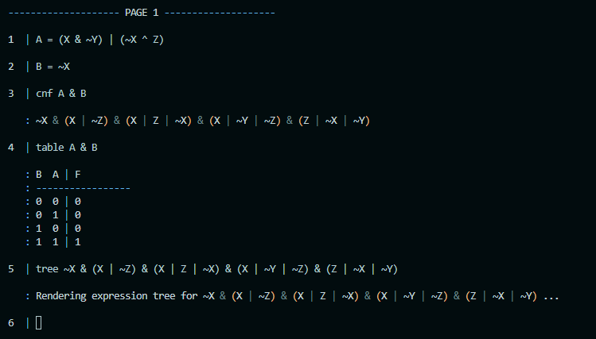
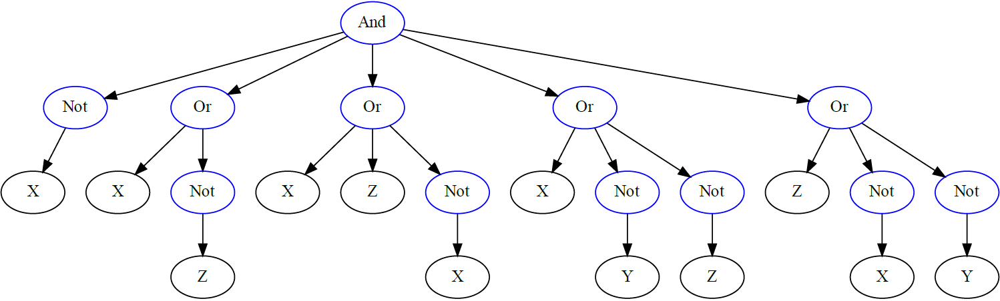

# CLEA (Command-line Logic Expression Assessor)
## Introduction
A command line application that assists in simplifying, evaluating and visualising logical expressions for software developers.



Rendered expression tree:


## Installation
```
git clone git@github.com:charljdp/clea.git
pip install -e ./application
```

## Python dependencies
- [Sympy](https://www.sympy.org/)
- [Graphviz](https://graphviz.readthedocs.io) (The Graphviz Python package)
- [Colorama](https://github.com/tartley/colorama)

## External dependencies
- [Graphviz](https://www.graphviz.org/) (The original Graphviz)

## Development
- [pipenv](https://pipenv.pypa.io/)
- [pytest](https://docs.pytest.org/)

## Unit testing
```
ENV=test && export ENV && pipenv run pytest
```